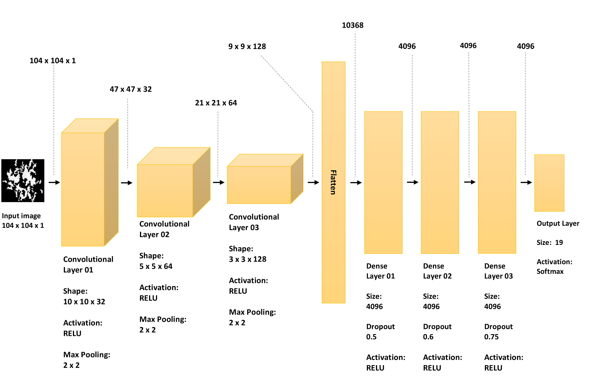

## A Novel Multi-mode Fiber Optic Accelerometer: An Intelligent Sensor
### [[Paper]](https://doi.org/10.1117/12.2305164) 


This repository contains the default model for the above paper which presents an architectural design of a novel intelligent accelerometer sensor, constructed from a multi-mode fiber optic cable.  We used a deep learning approach to analyze the shape of speckle patterns. A multilayer feed-forward convolutional neural network (CNN) classifies images of speckle pattern into distinct pre-known classes of acceleration vectors. The results confirm that this novel accelerometer sensor performs as well as a MEMS accelerometer. For more information please refer to the [Paper](https://doi.org/10.1117/12.2305164).


<br/>

## Dependencies

* [Python 2.7+](https://www.continuum.io/downloads)  
* [Keras 2.0.8+](http://pytorch.org/)  
* [TensorFlow 1.3+](https://www.tensorflow.org/) (optional for tensorboard)  
* [Pandas](https://pandas.pydata.org/)  


<br/>

## Project Structure
The code requires a directory with the following structure:  


	Root  
	    │  
	    ├── CAT  (Image dataset)  
	    │   │
	    │   ├─ Accelerometer Class 1 
	    │   │   ├── xxx.jpg (name doesn't matter)
	    │   │   ├── yyy.jpg (name doesn't matter)
	    │   │   └── ...
	    │   │
	    │   ├── Accelerometer Class 2
	    │   │   ├── xxx.jpg (name doesn't matter)
	    │   │   ├── yyy.jpg (name doesn't matter)
	    │   │   └── ...
	    │   │
	    │   ├── Accelerometer Class 3
	    │   │   ├── xxx.jpg (name doesn't matter)
	    │   │   ├── yyy.jpg (name doesn't matter)
	    │   │   └── ...
	    │   │
	    │   ├── ....
	    │   │   ├── xxx.jpg (name doesn't matter)
	    │   │   ├── yyy.jpg (name doesn't matter)
	    │   │   └── ...
	    │   │
	    │   ├──model (saved models) 
	    │   │   └── xxxxx.hdf5
	    │   │
	    │   ├──log (saved log for Tensorboard) 
	    │   │   └── events.out.tfevents.xxxxxxx (name doesn't matter)
    
    
    
<br/>
## Dataset
 Full dataset and pre-processing details are not available due to commercial sensitivity and pending pattent. Here is an example of raw speckle  and its corresponding pattern resulted from an image processing pipeline.
 
  Raw pattern (Right) Extracted pattern")


<br/>
## Convolutional Network Architecture
 
 
 
 <br/>
## Usage
Run the model by:

    cd <repo directory >
    cd scripts
    python demo.py
    
 <br/>
### Citation

If you find the paper, code, model, or data usefu, please cite our paper:

```
@proceeding{doi: 10.1117/12.2305164,
author = { Soroush  Razmyar,M. Taghi  Mostafavi},
title = {A novel multi-mode fiber optic accelerometer: an intelligent sensor},
journal = {Proc.SPIE},
volume = {10654},
pages = {10654 - 10654 - 13},
year = {2018},
doi = {10.1117/12.2305164},
URL = {https://doi.org/10.1117/12.2305164},
}
```
